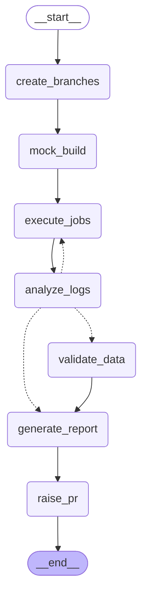

# Upgrade Regression Testing Agent

An agentic system that automates regression testing of Spark version upgrades
(3.5 → 4.0) for PySpark data pipelines. It creates GitHub branches, runs
baseline and target Spark jobs locally, analyzes logs for known breaking
changes, applies corrective fixes automatically, retries, validates data
output parity, and generates a report with a pull request summarizing the
result.

## Why

Spark 4.0 introduces several breaking changes versus 3.5 — most notably ANSI
SQL mode being on by default, which turns silent NULL-producing operations
(division by zero, integer overflow, invalid casts) into runtime exceptions.
Manually testing every pipeline against these changes is slow. This agent
automates the detect → diagnose → fix → retry → validate → report loop.

## How it works

1. **Branch**: creates baseline and target branches in GitHub, applying the
   target Spark version change to the target branch.
2. **Build**: verifies the pipeline files are present on both branches.
3. **Execute**: runs the pipeline locally under both Spark versions.
4. **Analyze**: on failure, matches the error against known Spark 4.0
   breaking-change patterns (regex, instant and free) before falling back to
   an LLM-based diagnosis for unrecognized failures.
5. **Retry**: applies the corrective fix (e.g. re-enabling
   `spark.sql.ansi.enabled=false`) and re-runs, up to a configured retry limit.
6. **Validate**: compares baseline vs. target Parquet output — row counts,
   schema, column-level values within tolerance, null counts.
7. **Report**: generates an HTML/JSON report of what broke, what was fixed,
   and the validation outcome.
8. **PR**: raises a GitHub pull request summarizing the test run.

## Development approach

Everything runs locally first. AWS services (Step Functions, EventBridge,
EMR, Fargate, DynamoDB, S3, SNS) are mocked with local Python classes and
`moto`. GitHub is the only real external dependency. Once the full flow works
locally, the mocks are swapped for real AWS clients with no orchestrator code
changes (see `src/mock_infra/aws_clients.py`'s `use_mocks` toggle).

## Tech stack

- Python 3.11+ (developed against 3.12)
- PySpark 3.5.4 (baseline) and 4.0.0 (target)
- LangGraph for the orchestrator state graph
- Pydantic for manifest/config validation
- `moto` for local AWS mocks
- GitHub REST API (via `httpx`) for real branch/PR operations
- OpenAI API (`gpt-4o-mini`) for LLM-based log diagnosis fallback
- Streamlit for the run-status dashboard

## Project layout

The pipeline under test ([customer-transactions-pipeline](https://github.com/vivekaradshan/customer-transactions-pipeline))
lives in its own repo, not here — this agent tests external pipeline repos
via GitHub branches/PRs rather than modifying its own source. Locally it's
cloned into a gitignored `workspace/` directory.

```
manifests/                 Test manifest YAML files (upgrade test definitions)
src/
  config/                  Manifest Pydantic models, settings
  tools/                   GitHub client, DynamoDB state store, data validator
  mock_infra/              Mocked Step Functions, EventBridge, EMR runner, AWS clients
  analysis/                Log reading, pattern matching, LLM analysis, corrective actions
  orchestrator/            LangGraph state graph and workflow nodes
  reporting/               HTML/JSON report generation
  cli.py                   CLI entry point (run / status / cleanup)
dashboard/                 Streamlit dashboard
tests/
  unit/                    Unit tests
  e2e/                     Full end-to-end integration test
```

## Orchestrator graph

The orchestrator is a [LangGraph](https://github.com/langchain-ai/langgraph)
state graph. This diagram is generated directly from the compiled graph
(`build_graph(...).get_graph().draw_mermaid()`), not hand-drawn, so it always
reflects the real code:



The dashed edges out of `analyze_logs` are its conditional routing: a
known, auto-fixable failure loops back to `execute_jobs` for a retry (up to
the manifest's `max_retries`); a successful target job proceeds to
`validate_data`; anything else (not auto-fixable, or retries exhausted)
skips straight to `generate_report`, since there's nothing to compare.

## Sample report

[`docs/sample-report/report.html`](docs/sample-report/report.html) is a real
report generated by an actual test run — not a mockup. It shows the ANSI
mode failure being detected, the auto-fix committed, the retry succeeding,
and all three validation checks passing.

## Running a test

```bash
python -m src.cli run --manifest manifests/spark-3.5-to-4.0.yaml
python -m src.cli status --run-id <run_id>
python -m src.cli cleanup --run-id <run_id>
```

## Status

Under active development — see the build plan for step-by-step progress.
